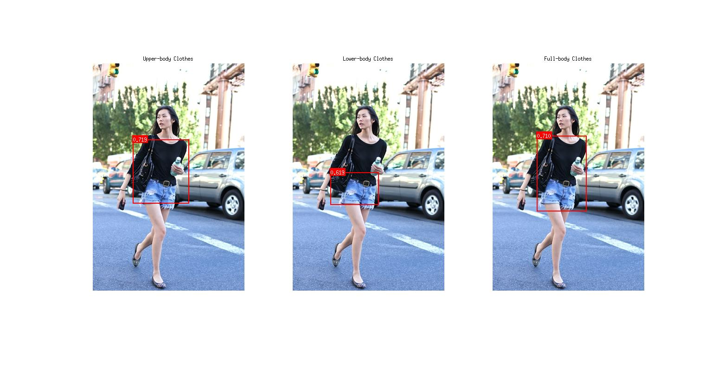

## Fashion Detection in the Wild
[[Project]](http://personal.ie.cuhk.edu.hk/~lz013/projects/DeepFashion.html) [[Paper]](http://www.cv-foundation.org/openaccess/content_cvpr_2016/papers/Liu_DeepFashion_Powering_Robust_CVPR_2016_paper.pdf)   


## Overview
It is a clothes detection framework based on [Fast R-CNN](https://github.com/rbgirshick/fast-rcnn). Given a fashion image, this software finds and localizes potential `upper-body clothes`, `lower-body clothes` and `full-body clothes` in it, respectively. 



Further information please contact [Ziwei Liu](http://personal.ie.cuhk.edu.hk/~lz013/).

## Requirements
* [Fast R-CNN](https://github.com/rbgirshick/fast-rcnn)
* [EdgeBox](https://github.com/pdollar/edges)
* [Piotr's Computer Vision Toolbox](https://github.com/pdollar/toolbox)

## Getting started
* Install and compile the [Fast R-CNN](https://github.com/rbgirshick/fast-rcnn), [EdgeBox](https://github.com/pdollar/edges) and [Piotr's Computer Vision Toolbox](https://github.com/pdollar/toolbox) libraries.
* Download the pre-trained model [fashion_detector.caffemodel](https://drive.google.com/open?id=0B7EVK8r0v71pUlZjeGZuNWZLaFU):
``` bash
Place "fashion_detector.caffemodel" into "./models/" 
```
* Run the testing script:
``` bash
matlab ./demo.m
```

## Dataset
[Large-scale Fashion (DeepFashion) Database](http://mmlab.ie.cuhk.edu.hk/projects/DeepFashion.html)

## Citation
```
@inproceedings{liu2016deepfashion,
 author = {Ziwei Liu, Ping Luo, Shi Qiu, Xiaogang Wang, and Xiaoou Tang},
 title = {DeepFashion: Powering Robust Clothes Recognition and Retrieval with Rich Annotations},
 booktitle = {Proceedings of IEEE Conference on Computer Vision and Pattern Recognition (CVPR)},
 month = {June},
 year = {2016} 
}
```
